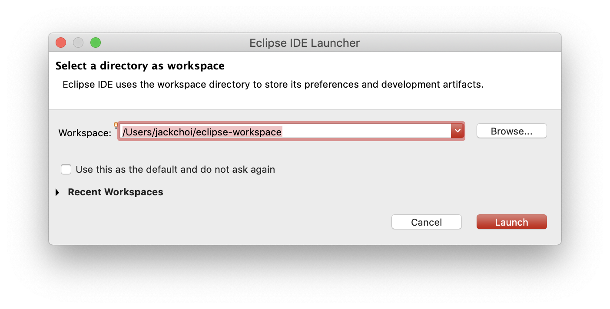
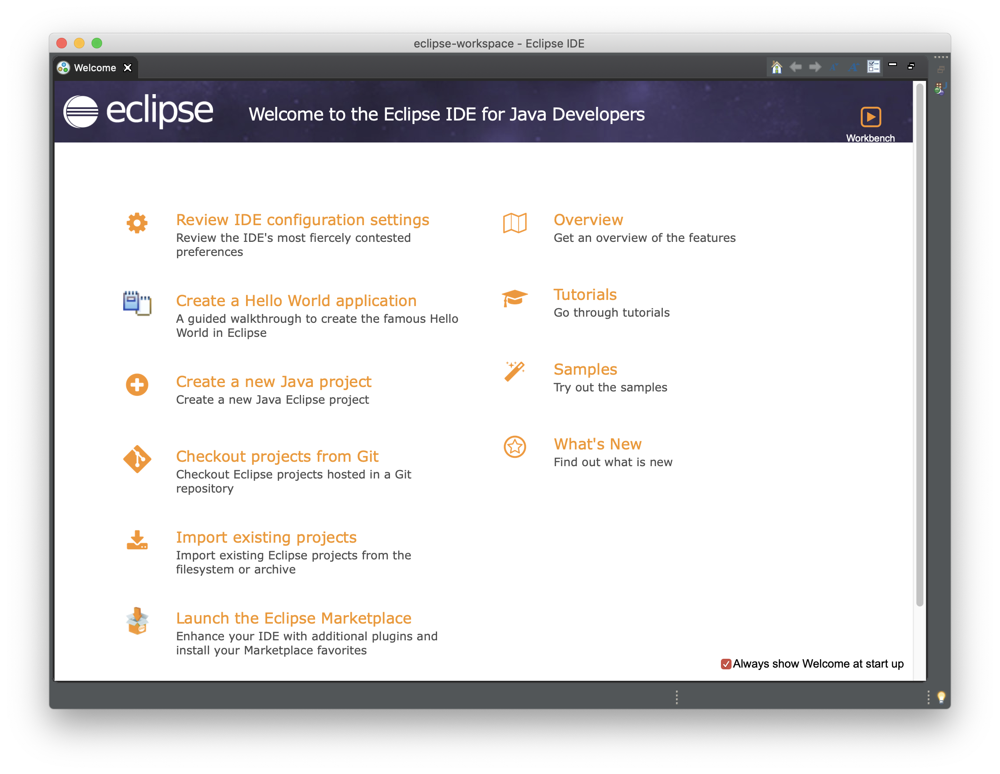
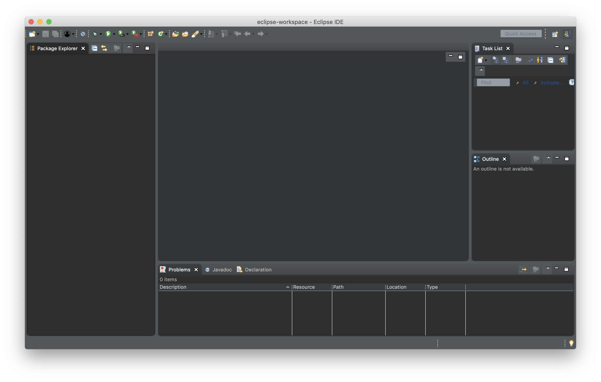
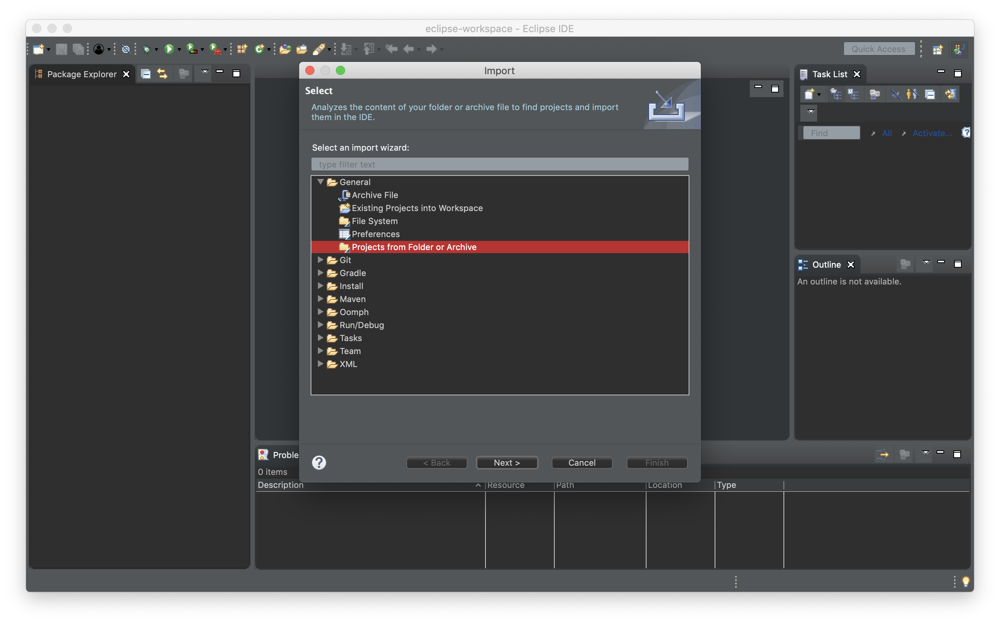
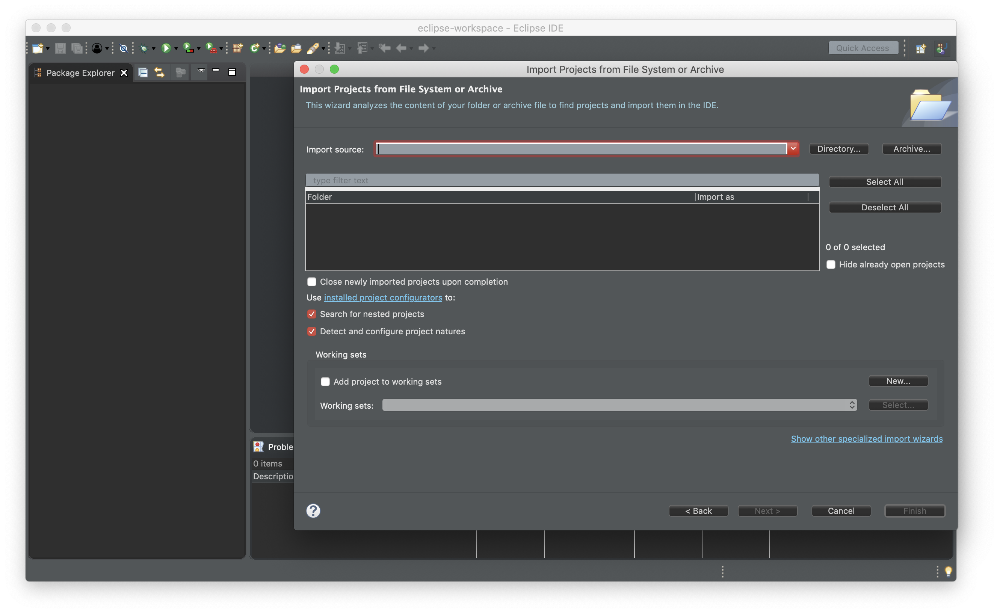
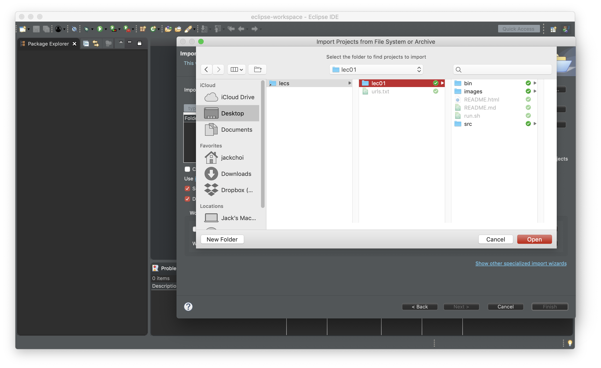
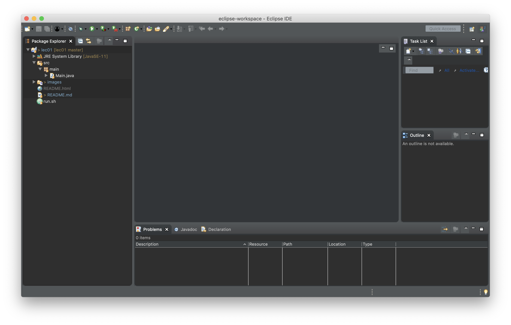
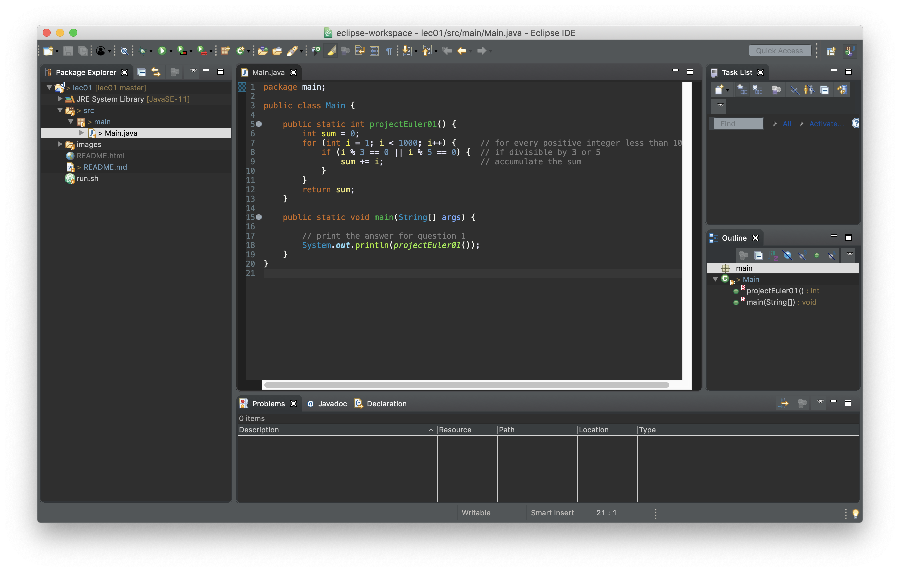
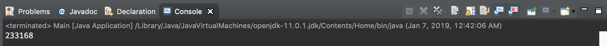

# 6.178 Lecture 1

Lecture 1 will focus on getting familiar with Java. Instead of learning about complicated features of Java that make Java special, we will learn how to perform universal programming tasks that can be used to solve most practical problems. In other words, tasks that you can already do in the languages you are familiar with.

The first half of class will be the presentation of materials. The rest will be practice problems, and the staff will walk around to help.

Instead of explaining every little detail, this lecture will present examples. You are strongly encouraged to read through __`Readings`__ that can be found throughout this lecture.

People from various background take 6.178, and the staff members understand this. This lecture assumes that you are familiar with basic programming concepts, at a level somewhere between 6.0001 and 6.009. If the materials presented in this lecture seem too much, or too fast-paced, please ask questions on Piazza and come to office hours.

Lastly, let us know if you have any [anonymous thoughts or feedback about this course or this lecture](https://goo.gl/forms/0IhxMZG0gO63qxg13)!

## Table of Contents

- [Table of Contents](#table-of-contents)
- [Logistics](#logistics)
- [Java](#java)
  - [Major Syntax Differences from Python](#major-syntax-differences-from-python)
  - [Types](#types)
  - [Declaration vs Assignment](#declaration-vs-assignment)
  - [Primitive Types](#primitive-types)
  - [Array](#array)
  - [Compilation vs Interpretation](#compilation-vs-interpretation)
  - [Comments](#comments)
  - [Printing](#printing)
  - [Operations](#operations)
  - [If Else](#if-else)
  - [For Loops](#for-loops)
  - [While Loops](#while-loops)
  - [Object Types](#object-types)
  - [String](#string)
  - [List](#list)
  - [Set](#set)
  - [To/From Lists and Sets and Copying](#tofrom-lists-and-sets-and-copying)
  - [Map](#map)
  - [Functions](#functions)
  - [Java File](#java-file)
  - [Some Java Examples](#some-java-examples)
- [Git and GitHub](#git-and-github)
  - [Clone This Lecture's Repo](#clone-this-lectures-repo)
- [Eclipse](#eclipse)
  - [Importing a Java Project](#importing-a-java-project)
  - [Running a Java File with Eclipse](#running-a-java-file-with-eclipse)
- [Problems](#problems)

## Logistics

- __IMPORTANT: SET UP [6.178 tools](https://github.com/jchoi5me/ToolSetup)__
  - if you are a cross-registrant, please find Jack after lecture and email `jchoi5me@mit.edu`
- you will either `pass` or `fail` 6.178
  - you need to pass __all 3 labs__ to pass the course
  - the grade needed to pass the course has not been determined yet
- there will be a lab assignment each week
  - each one is released every `Friday at 10pm`, due the `following Friday at 10pm`
  - first lab will be released at `10pm on Friday, Jan 11th`
  - lab grade is determined entirely from number of test-cases passed
- lectures are `MWF 11am-1pm` in room `2-190`
  - not mandatory but `good attendance = insurance` and will bump your letter grade if you are slightly below the cutoff
  - lectures will be hands on and interactive, so coming to lectures will be helpful
- office hours are `TR 11am-4pm` in room `34-303`
  - please come!
- ask questions on Piazza
  - __DO NOT POST CODE__ unless it is a private post to the instructors
  - make basically all other questions public
  - for personal concerns, email `6178-staff@mit.edu`
- announcements will be made via Piazza and email

## Java

__`Readings`__:
1. [Oracle Java Tutorials](https://docs.oracle.com/javase/tutorial/java/nutsandbolts/index.html)
1. [Oracle Java Code Conventions](https://www.oracle.com/technetwork/java/codeconventions-135099.html).

We will frequently compare Java and Python, since most students taking this class are familiar with Python.

### Major Syntax Differences from Python

1. every statement must end with `;`
1. indents, spacings and newlines do not affect correctness of your code but stay consistent for readability:
    ```java
    // bad, but still works
    while ( a
    < 3

    ) {
                  a++;

    }
    ```

    ```java
    // good
    while (a < 3) {
        a++;
    }
    ```

### Types

Think about the following question.

> Say we have a variable whose type is `String` at some point in a program. Does it make sense for it to become an `int` later in the same program?

1. every variable in Java has a type
    - if a variable has a type `int`, it can only be `int` for the rest of the program
1. every function has types that need to be enforced
    - more on this later

### Declaration vs Assignment

- `declaration`: declare that a variable has been created, with a certain type
  ```java
  int x;
  ```
- `assignment`: assign a value to a variable
  ```java
  x = 3;
  ```

When you first use a variable, most people do both at the same time.
```java
int x = 3;  // declare and assign at the same time
// ...
x = 4;      // re-assign its value
// ...
int x = 5;  // ERROR! can only declare variables once
```

### Primitive Types

__`Readings`__: [Java Primitives](https://docs.oracle.com/javase/tutorial/java/nutsandbolts/datatypes.html)

Java has a number of basic, _primitive_ types. Primitives have type names that are lower-cased.

```java
boolean over21 = true;
char favoriteAlphabet = 'J';
double temperature = 34.5;
int age = 42;
```

### Array

__`Readings`__: [Java Arrays](https://docs.oracle.com/javase/tutorial/java/nutsandbolts/arrays.html)

Java arrays are like lists, except that they have a fixed length and can only contain a single type.

```java
// java
int[] ages = new int[12];       // int array of length 12
ages[0] = 16;                   // [ 0, 0, 0, 0, 12, 0, 0, 0, 0, 0, 0, 0 ]

double[] temps = { 1.2, 3.4 };  // directly create an array with elements pre-specified
```

### Compilation vs Interpretation

__`Readings`__: [6.031 reading on Static Checking](http://web.mit.edu/6.031/www/fa18/classes/01-static-checking/)

Below are very simplified diagrams that show how Python and Java work:

`Python`:
```
----------------------
| Python Source Code |   Python Interpreter    ----------
|    `.py` files     |  ====run/interpret===>  | Action |
----------------------                         ----------
```

`Java`:
```
--------------------                   ------------------
| Java Source Code |   Java Compiler   | Java Bytecode  |   Java Virtual Machine    ----------
|  `.java` files   |  ====compile===>  | `.class` files |  ====run/interpret====>   | Action |
--------------------                   ------------------                           ----------
```

You don't need to understand everything in detail. Just know that:
1. Java needs to be compiled before it is run, which is not the case for Python
1. the time during which compilation happens is known as the `compile-time`
1. the time during which your code is run is known as the `runtime`

```java
int number = 3;
numbre += 2;                        // misspelled word
System.out.println("abc", "cde");  // wrong number of arguments
Integer.toString("14");            // this method expects int, not String
```

If you try to compile the code above, the Java compiler `javac` will throw errors. There are too many advantages to catching errors during compile-time rather than runtime. I suggest you look them up if you are interested.

### Comments

```python
# python
foo(x, y, 3) # python uses hashtags
```
```java
// java
foo(x, y, 3); // java uses double backslashes
foo(x, y, /* also supports in-line comments */ 3);
```

### Printing
```python
print('hello world')  # python
```
```java
System.out.println("hello world");  // java
```

### Operations

Most basic operations are identical to those in Python, except for logical operations.

```java
int num = 5;
num + 2;
num - 2;
num * 2;
num / 2;  // is 2, because this is integer division
5 % 2;    // modulo (Remainder)
num++;    // equivalent to `num += 1` equivalent to `num = num + 1`
num--;    // equivalent to `num -= 1` equivalent to `num = num - 1`

boolean isCold = true;
boolean and = isCold && false;  // logical `and`, evaluates to false
boolean or = isCold || false;   // logical `or`, evaluates to true
boolean not = !isCold;          // logical `not`, evaluates to false
```

### If Else

```python
# python
someNumber = 54
if someNumber < 10:
    print('less than 10')
elif someNumber > 10:
    print('greater than 10')
else:
    System.out.println("equals 10")
```
```java
// java
int someNumber = 54;
if (someNumber < 10) {
    System.out.println("less than 10");
} else if (someNumber > 10) {
    System.out.println("greater than 10");
} else {
    System.out.println("equals 10");
}
```

### For Loops

A basic `for` loop in Java has the following form:

```java
for (init; condition; update) {
    // body
}
```
- `init`: evaluated before the first iteration of the loop
- `condition`: evaluated before every iteration; if false, loop exits
- `update`: evaluated after every iteration

For example, let's print the numbers `0, 1, 2, ..., 9` using a for loop:
```python
# python
for i in range(10):
    print(i)
```
```java
// java
// i = 0 when you enter the loop for the first time
// this for loop will keep looping as long as i < 10
// increment i by 1 after each iteration of the for loop
for (int i = 0; i < 10; i++) {
    System.out.println(i);
}
```

### While Loops

```python
# python
i = 0
while i < 10:
    print(i)
    i += 1
```
```java
// java
int i = 0;
while (i < 10) {
    System.out.println(i);
    i++;
}
```

### Object Types

For this lecture, the only object types we care about are `String`, `ArrayList`, `HashSet` and `HashMap` which are analogous to Python's `str`, `list`, `set` and `dict`. We will talk more about them in the future, so just memorize them for today.

Object types have type names whose first letter is capitalized.

### String

__`Readings`__: [String Documentation](https://docs.oracle.com/javase/7/docs/api/java/lang/String.html)

```python
# python
name = 'Jack'
first_half = name[0:2]      # 'Ja'
first_char = name[0]        # 'J'
full_name = name + ' Choi'  # 'Jack Choi'
num_as_str = str(2)         # '2'
```
```java
// java
String name = "Jack";
String firstHalf = name.substring(0, 2);          // "Ja"
char firstChar = name.charAt(0);                  // 'J'
String firstCharAsString = name.substring(0, 1);  // Note that this is String, not char
String fullName = name + " Choi";                 // "Jack Choi"
String numAsStr = String.valueOf(2);              // "2"
```

### List

__`Readings`__: [ArrayList Documentation](https://docs.oracle.com/javase/8/docs/api/java/util/ArrayList.html)

In Java, lists can only contain elements of the same type. For example:

```java
List<String> strings = new ArrayList<>();   // list of String
List<Integer> ints = new ArrayList<>();     // list of Integer
List<Character> chars = new ArrayList<>();  // list of Character
```

Notice that when making a list of `int`, we write `List<Integer>` rather than `List<int>`. Make sure that when making a list of primitives, use their `Object Type` counterpart:

| Primitive Type | Object Type |
| :---:          | :---:       |
| `boolean`      | `Boolean`   |
| `char`         | `Character` |
| `double`       | `Double`    |
| `int`          | `Integer`   |

Working with a list of strings, via examples:

```python
# python
months = []
months.append('January')

first = months[0]  # 'January'

for i in range(len(months)):  # iterate using indices
    month = months[i]
for month in months:          # iterate directly
    print(month)
if 'Feb' not in months:       # membership check
    print('Feb is not in list')

sorted_months = sorted(months)  # make a sorted copy
```
```java
// java
List<String> months = new ArrayList<String>();    // you can write `new ArrayList<>()` for simplicity
months.add("January");

List<String> immutableMonths = List.of(1, 2, 3);  // immutable, so you cannot add or change

String first = months.get(0);

for (int i = 0; i < months.size(); i++) {  // iterate using indices
    String month = months.get(i);
}
for (String month : months) {              // iterate directly
    System.out.println(month);
}
if (! months.contains('Feb')) {            // membership check
    System.out.println("Feb is not in list");
}

List<String> sortedMonths = new ArrayList<>(months);  // make a copy
Collections.sort(sortedMonths);                       // actually sort it
```

### Set

__`Readings`__: [HashSet Documentation](https://docs.oracle.com/javase/7/docs/api/java/util/HashSet.html)

Just like lists, sets can only contain elements of the same type. For example:

```java
Set<String> strings = new HashSet<>();   // set of String
Set<Integer> ints = new HashSet<>();     // set of Integer
Set<Character> chars = new HashSet<>();  // set of Character
```

Working with a set of ints, via examples:

```python
# python
numbers = set()
numbers.add(1)

immutable_numbers = frozen_set({ 1, 2, 3 })  # immutable, so you cannot add or change

for month in numbers:                        # iterate directly
    print(month)
if 2 not in numbers:                         # membership check
    print('Feb is not in list')
```
```java
// java
List<String> numbers = new ArrayList<String>();   // you can write `new ArrayList<>()` for simplicity
numbers.add(1);

Set<String> immutableNumbers = Set.of(1, 2, 3);   // immutable, so you cannot add or change

for (String month : numbers) {                    // iterate directly
    System.out.println(month);
}
if (! numbers.contains(2)) {                      // membership check
    System.out.println("Feb is not in list");
}
```

### To/From Lists and Sets and Copying

```python
# python
original_set = { 1, 2, 3 }
original_list = [ 1, 1, 3 ]

copy_of_list = list(original_list)  # [ 1, 2, 3 ]
copy_of_set = set(original_set)     # { 1, 3 }

set_from_list = list(original_set)  # [ 1, 2, 3 ]
list_from_set = set(original_list)  # { 1, 3 }
```
```java
// java
List<Integer> originalList = List.of(1, 1, 3);
Set<Integer> originalSet = Set.of(1, 2, 3);

List<Integer> copyOfList = new ArrayList<>(originalList);  // [ 1, 2, 3 ]
Set<Integer> copyOfSet = new HashSet<>(originalSet);       // { 1, 3 }

Set<Integer> listFromSet = new HashSet<>(originalList);    // { 1, 3 }
List<Integer> setFromList = new ArrayList<>(originalSet);  // [ 1, 2, 3 ]
```

### Map

__`Readings`__: [HashMap Documentation](https://docs.oracle.com/javase/8/docs/api/java/util/HashMap.html)

A `Map` is like Python's `dict`.

```python
# python
months = {}
months[1] = 'January'         # assign
months[3] = 'March'           # assign

for key in months.keys():     # iterate through keys
    print(key)
for value in months.values(): # iterate through values
    print(value)
```
```java
// java
Map<Integer, String> months = new HashMap<>();
months.put(1, 'January');               // assign
months.put(3, 'March');                 // assign

for (int key : months.keySet()) {       // iterate through keys
    System.out.println(key);
}
for (String value : months.values()) {  // iterate through values
    System.out.println(value);
}
```


### Functions

- a function can only return a value with a certain type
- every parameter has a type
- example: function that takes in a list and returns the number of its elements
  ```java
  int sizeOf(List<Integer> list) {
      // ...
  }
  ```

For this lecture, put `public static` in front of every function. This will be explained more in the upcoming lectures. The above function should look like:
```java
public static int sizeOf(List<Integer> list) {
    // ...
}
```

### Java File

Let's consider a file `Main.java` inside a project that looks like:
```
SomeProject/
└── src/
    └── main/
        └── Main.java
```

The content in `Main.java` may look something like the following:

```java
package main;

public class Main {

    public static int exampleFunction() {
        return 5;
    }

    public static void main(String[] args) {
        System.out.println("hello world");
    }
}
```

- the `package` name must match the directory name that contains the file
- `class` name must be identical to the file name
- the `main` method is executed when this file is run
  - implies that no action is taken when running a Java file without a main method
  - any statements that you want to execute must be placed inside the `main` method

### Some Java Examples

1. Function that returns a list of even numbers `x` such that `low <= x < high`:
    ```java
    public static List<Integer> evenNumbers(int low, int high) {
        List<Integer> result = new ArrayList<>();
        for (int i = low; i < high; i++) {
            if (i % 2 == 0) {  // if even
                result.add(i);
            }
        }
        return result;
    }
    ```
1. Function that sums up doubles in a list:
    ```java
    public static double sumDoubles(List<Double> doubles) {
        double sum = 0;
        for (double number : doubles) {
            sum += number;
        }
        return sum;
    }
    ```
    ```java
    public static double sumDoublesUsingIndices(List<Double> doubles) {
        double sum = 0;
        for (int i = 0; i < doubles.size(); i++) {
            sum += doubles.get(i);
        }
        return sum;
    }
    ```
1. Function that makes a copy of a list:
    ```java
    public static List<Double> copy(List<Double> toCopy) {
        List<Double> copied = new ArrayList<>();
        for (double number : toCopy) {
            copied.add(number);
        }
        return copied;
    }
    ```

## Git and GitHub

__`Readings`__:
1. [6.031 reading on Version Control](http://web.mit.edu/6.031/www/fa18/classes/05-version-control/), you __DON'T__ need to know how to use Git in a multi-person setting
1. [Step 5 of 6.031 reading on Git](http://web.mit.edu/6.031/www/fa18/getting-started/), __WITHOUT__ doing the GitStream exercises

The 6.178 GitHub page can be found by visiting `https://github.mit.edu/orgs/6178-2019`.

Consider a file named `Main.java`, in your `Downloads` directory. We can specify this file using a file-path, as `~/Downloads/Main.java`. Some important paths:
- `~` - called [`tilde`](https://en.wikipedia.org/wiki/Tilde), it represents your `HOME`
    - what `~` represents is configurable, but it's usually something along the lines of `/Users/jackchoi`
    - you can find out your `HOME` by running `echo $HOME` in Bash
    - usually contains files like the following, if you use Mac
    ```
    Applications    Desktop    Documents    Downloads    Dropbox (MIT)
    Library         Movies     Music        Pictures     Public
    ```
- `/` - the `root`
    - you don't need to know much about this, besides that it is called the `root`

### Clone This Lecture's Repo

Let's clone this lecture's repo to your `Desktop`:

```bash
cd ~/Desktop/                                     # or any other directory
git clone git@github.com:jchoi5me/lec01.git  # the SSH URL of lecture 1 repo
```

This creates a directory called `lec01` in your `Desktop`, and it contains all files that `lec01` remote repo contained.

## Eclipse

Eclipse is an IDE that 6.031 uses, as well as many other Java developers.

### Importing a Java Project

1. you will likely see the following, when you first launch Eclipse; hit `Launch` 
1. you might see this too; hit the `x` button next to `Welcome` at the top left 
1. this is what you should see, as the main screen of Eclipse 
1. selecting `File > Import` will show you the following window; select `Projects from Folder or Archive` as shown in the image below 
1. select `Directory..` next to the box selected in the image below 
1. find and open the repo you cloned 
1. `lec01` should be visible on the left 

### Running a Java File with Eclipse

1. open the file 
1. from the liust of icons at the top of the window, find and click the button that looks like 
1. results are displayed at the bottom of the window 

## Problems

- solutions will be posted sometime later in the day, but try to work through them before looking at solutions
- this repo contains `src/main/Main.java`, where problem 1 has been worked out for you
  - work on the rest of the problems in this file
  - make a function for each problem, following the style of `projectEuler01`
  - make helper functions and follow good programming practice

Practice problems: [Project Euler](https://projecteuler.net) - Google for answers
  - [Problem 1](https://projecteuler.net/problem=1)
  - [Problem 2](https://projecteuler.net/problem=2)
  - [Problem 4](https://projecteuler.net/problem=4)
  - [Problem 5](https://projecteuler.net/problem=5)
  - [Problem 6](https://projecteuler.net/problem=6)
  - [Problem 9](https://projecteuler.net/problem=9)
  - [Problem 14](https://projecteuler.net/problem=14)
  - [Problem 21](https://projecteuler.net/problem=21)
  - [Problem 23](https://projecteuler.net/problem=23)
  - [Problem 29](https://projecteuler.net/problem=29)
  - [Problem 30](https://projecteuler.net/problem=30)
  - [Problem 32](https://projecteuler.net/problem=32)
  - [Problem 33](https://projecteuler.net/problem=33)
  - [Problem 34](https://projecteuler.net/problem=34)
  - [Problem 36](https://projecteuler.net/problem=36)
